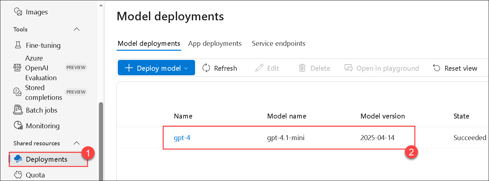
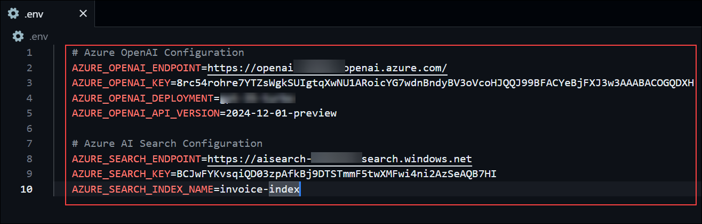

# Exercise 2: LangChain Tools & Retrieval Chain

### Estimated Duration: 30 Minutes

## Overview

In this exercise, you will integrate Azure AI Search with LangChain by wrapping your search index as a retriever and building a RetrievalQA chain powered by Azure OpenAI. These steps will enable your chatbot to fetch relevant context from indexed content and use it to generate accurate, grounded responses.

**LangChain** is a framework that simplifies building AI applications by connecting language models (like those from OpenAI) with external data, tools, and memory. It enables developers to create context-aware, interactive apps that can retrieve information, process queries, and maintain conversation history.

How it Helps in AI Application Development:

- **Data Integration:** Combines LLMs with external data sources (e.g., documents, databases) for accurate, context-rich responses.
- **Tool Access:** Allows AI to use tools like search or APIs, enhancing functionality (e.g., invoice lookup).
- **Memory Management:** Maintains conversation history for coherent, personalized interactions.
- **Simplified Workflow:** Provides pre-built components (e.g., retrievers, chains) to speed up development.
- **Flexibility:** Supports custom workflows, making it easier to build complex AI apps, like chatbots or Q&A systems, with minimal coding.

## Objectives

You will be able to complete the following tasks:

- Task 1: Implement Search Retriever Tool

- Task 2: Build RetrievalQA Chain

## Task 1 : Define & Populate Search Index

In this task, you will install the necessary LangChain community package and import the AzureSearchVectorStore class. This allow you to wrap your Azure AI Search index as a retriever, making it accessible for downstream question-answering workflows within LangChain.

1. Once you have setup Azure Index in previous task, now its time to develop a retriver using langchain.

1. Navigate to **Visual Studio Code**  from the desktop of JumpVM.

1. From the top menu, click on **file** and select **Open Folder** option.

   

1. From the open folder pane, navigate to `C:\codefiles\Knowledge-Augmented-Chatbot-with-LangChain-and-AI-Search-datasets` and click on open folder.

1. In the pop up window click on Trust.

1. Now, you can see that there are some files present in this folder. In these further tasks, you will complete these code files.

   

1. From the **explorer**, select and open `exercise2_retrieval.py`.

1. Once you are in the file, review the file once then navigate to **Task 1: Implement Search Retriever Tool** comment.

   

1. Under the comment, add the following code snippet.

   ```python
   class InvoiceSearchTool:
    """Tool wrapper for invoice search functionality"""
    
    def __init__(self):
        self.retriever = AzureAISearchRetriever()
    
    def search_invoices(self, query: str) -> str:
        """Search for invoices based on query"""
        documents = self.retriever.get_relevant_documents(query, k=5)
        
        if not documents:
            return "No relevant invoices found."
        
        results = []
        for i, doc in enumerate(documents, 1):
            results.append(f"Result {i}:\n{doc.page_content}")
        
        return "\n\n".join(results)
    
    def get_langchain_tool(self):
        """Return LangChain Tool object"""
        return Tool(
            name="invoice_search",
            description="Search for invoice information. Use this when you need to find specific invoices, customer information, products, or financial data.",
            func=self.search_invoices
        )
   ```

   >The InvoiceSearchTool class enables invoice searching using Azure AI Search.

   >It initializes with an AzureAISearchRetriever to fetch relevant documents.
     
   >The search_invoices method takes a query, retrieves the top 5 matching documents, and formats them into a string.

   >If no documents are found, it returns "No relevant invoices found."

   >The get_langchain_tool method wraps this functionality into a LangChain Tool for broader use.

   >Use it to find specific invoices, customer details, products, or financial data efficiently.

1. Once done, the file should look like this, verify it and use **CTRL + S** to save the file.

   

## Task 2: Build RetrievalQA Chain

In this task, you will create a RetrievalQA chain by connecting your search retriever to an Azure OpenAI language model. You will configure the chain to retrieve top-k search snippets and pass them along with user queries to the model, enabling the chatbot to provide informed, relevant answers.

1. Once the Search Retriever Tool is implemented, the next step is to create a chain that combines the retrieved data and passes it to the LLM. The LLM will then process this input and return a meaningful response.

1. In the same file, scroll down to the comment - **Task 2: Build RetrievalQA Chain**.

   

1. Below the comment, add the provided code snippet to implement RetrivalQA chain.

    ```python
    class InvoiceRetrievalQA:
    """RetrievalQA chain for invoice queries"""
    
    def __init__(self):
        # Initialize Azure OpenAI
        self.llm = AzureChatOpenAI(
            azure_endpoint=os.getenv("AZURE_OPENAI_ENDPOINT"),
            api_key=os.getenv("AZURE_OPENAI_KEY"),
            azure_deployment=os.getenv("AZURE_OPENAI_DEPLOYMENT"),
            api_version=os.getenv("AZURE_OPENAI_API_VERSION", "2024-02-01"),
            temperature=0.1
        )
        
        # Initialize retriever
        self.retriever = AzureAISearchRetriever()
        
        # Create RetrievalQA chain
        self.qa_chain = RetrievalQA.from_chain_type(
            llm=self.llm,
            chain_type="stuff",
            retriever=self.retriever,
            return_source_documents=True,
            verbose=True
        )
    
    def query(self, question: str):
        """Query the RetrievalQA chain"""
        try:
            result = self.qa_chain({"query": question})
            return {
                "answer": result["result"],
                "source_documents": result["source_documents"]
            }
        except Exception as e:
            return {
                "answer": f"Error processing query: {str(e)}",
                "source_documents": []
            }
   ```
   >The InvoiceRetrievalQA class enables question-answering about invoices by integrating document retrieval and language model generation.

   >It leverages Azure AI Search to retrieve relevant invoice documents and Azure OpenAI to generate answers based on them.

   >In the __init__ method, it initializes an Azure OpenAI language model with specific settings (e.g., low temperature for consistent responses) and sets up an AzureAISearchRetriever.

   >The query method takes a question, uses the retriever to find documents, generates an answer with the language model, and returns both the answer and source documents.

   >It includes robust error handling, returning an error message and empty document list if something fails.

   >This class provides an efficient way to get detailed, context-based answers to invoice-related queries.

1. Once done editing, verify that the snippet looks like this and use **CTRL + S** to save the file.

   

1. Now, use the create option and create file with name `.env`.

   

   

1. Once created, add the following content.

   ```
   # Azure OpenAI Configuration
   AZURE_OPENAI_ENDPOINT=https://openai-<inject key="Deployment ID" enableCopy="false"/>.openai.azure.com/
   AZURE_OPENAI_KEY=<inject key="OpenAI API Key" enableCopy="false"/>
   AZURE_OPENAI_DEPLOYMENT=gpt-35-turbo
   AZURE_OPENAI_API_VERSION=2024-12-01-preview

   # Azure AI Search Configuration
   AZURE_SEARCH_ENDPOINT=https://aisearch-<inject key="Deployment ID" enableCopy="false"/>.search.windows.net
   AZURE_SEARCH_KEY=<inject key="AI Search Service Key" enableCopy="false"/>
   AZURE_SEARCH_INDEX_NAME=invoice-index
   ```

   

1. From the overview page, click on **Go to Foundry Portal**.

   

1. You will be navigated to **Microsoft Foundry** portal. Select the **Deployments (1)** from left menu and click on **gpt-4 (2)**.

   

1. Once opened, scroll down and search for the code implementation part. Verify the **api_version** value in your `.env` file is same as the value sown in the portal, if not update the value to the value, shown in the portal.

   

1. Once done the `.env` file will look similar to this.

   

1. From the top menu, select **... (1)** and click on **Terminal  (2)** and from the list, select **New terminal  (3)**.

   

1. Run the following command in the terminal to install all the requirements.

   ```
   pip install -r requirements.txt
   ```

   

   

1. Once the requirements are satisfied, run the following command in the terminal to run the retriever.

   ```
   python exercise2_retrieval.py
   ```

   

1. Once you run it, you'll see the results. In the first step, the retriever fetches the relevant documents. In the next step, the LLM processes these documents and generates a meaningful answer based on the example prompts provided in the code files.

   

   

1. Now you have successfully completed the RetrievalQA Chain.

## Summary

In this exercise, you connected Azure AI Search with LangChain by wrapping your search index as a retriever and building a RetrievalQA chain using Azure OpenAI. These components worked together to enable the chatbot to retrieve relevant content and generate context-aware answers based on your indexed data.
