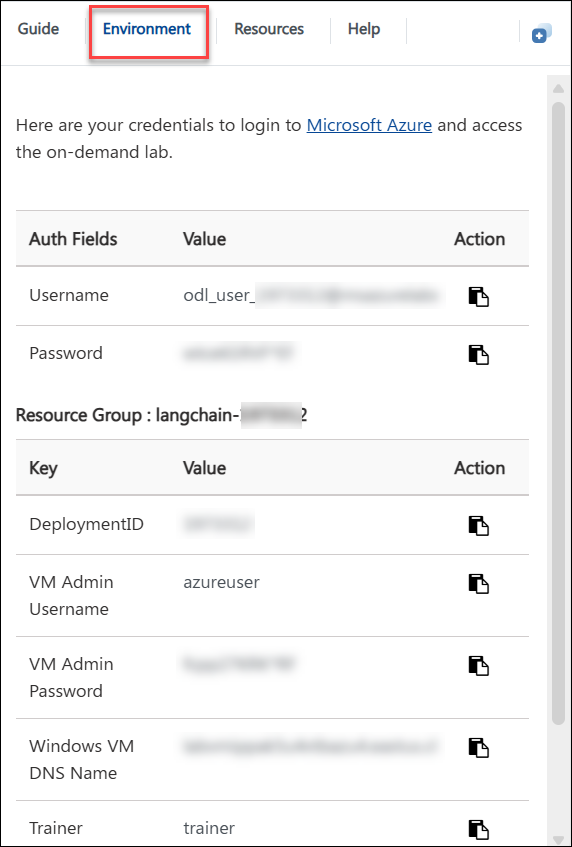
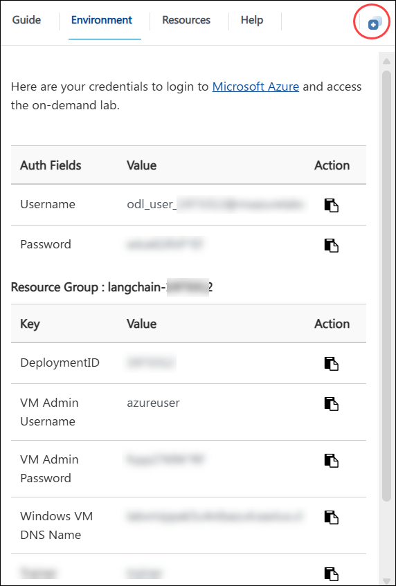
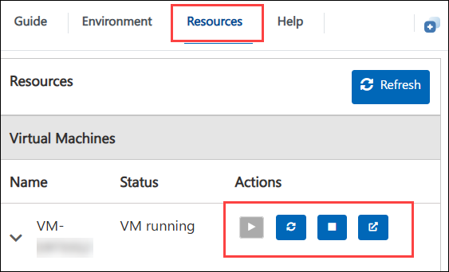
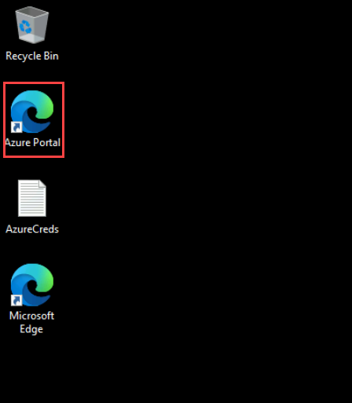

# Knowledge-Augmented Chatbot with LangChain & Azure AI Search

### Overall Estimated Duration: 2 Hours

## Overview

In this lab, you will build a knowledge-augmented chatbot that combines Azure AI Search with a powerful language model using LangChain. You will ingest sample documents and images, index them using Azure AI Search (with built-in OCR for images), and create a retrieval-augmented generation (RAG) chatbot that responds to user queries using this indexed data. You'll build LangChain tools and chains to query your index, assemble an agent with memory and observability, and finally run the chatbot locally using Streamlit to test multi-turn interactions.

## Objective

Learn to build and automate a knowledge-augmented chatbot using LangChain and Azure AI, leveraging tools like vector search, language models, and multi-turn agent planning. By the end of this lab, you will:

- **Content Ingestion & Index Creation:** Understand how to ingest, enrich, and index documents and images using Azure AI Search with OCR and skillsets

- **LangChain Tools & Retrieval Chain:** Gain insights into building a retrieval-augmented chatbot that grounds answers in enterprise content

- **Agent Assembly & Memory:** Build a LangChain agent equipped with tools and conversation memory to support multi-turn, contextual interactions

- **Deployment as an Azure Function:** Deploy and test your intelligent chatbot locally using Streamlit for rapid prototyping and prompt testing

## Pre-requisites

Participants should have the following prerequisites:

- **Familiarity with Azure Resources:** Basic understanding of Azure services and the Azure portal for managing cloud resources.

- **Knowledge of python:** Familiarity working with python.

## Architecture

The architecture enables end-to-end knowledge-augmented chatbot development by seamlessly ingesting, processing, indexing, and querying both documents and images using Azure AI Search and LangChain. Invoices and other documents added as searchable knowledge sources. Retrieval and reasoning are orchestrated through LangChain agents and large language models to enable contextual, multi-turn conversations. Finally, the agent is exposed through a lightweight Streamlit interface, delivering intelligent, grounded responses in a familiar, interactive format—ideal for rapid prototyping and enterprise integration.

## Architecture Diagram

## Explanation of Components

The architecture for this lab involves several key components:

- **Azure AI Search:** Serves as the core indexing and retrieval engine for your chatbot. It ingests documents and images, applies built-in cognitive skills like OCR and text extraction, and enables fast semantic search over your content. LangChain connects to Azure AI Search to retrieve the most relevant content snippets during chatbot interactions.

- **Azure OpenAI:** Provides large language models (LLMs) such as GPT-4, which power the chatbot's natural language understanding and generation. Integrated through LangChain, Azure OpenAI generates accurate, grounded responses by synthesizing user queries with content retrieved from Azure AI Search.

- **Visual Studio Code:** Acts as the primary development environment for building, testing, and debugging your LangChain-powered chatbot. With built-in terminal support and extensions for Python, Azure, and Streamlit, Visual Studio Code streamlines the entire development workflow—from writing LangChain scripts to launching a local chatbot interface.

- **Langchain:** is a framework that simplifies building AI applications by connecting language models (like those from OpenAI) with external data, tools, and memory. It enables developers to create context-aware, interactive apps that can retrieve information, process queries, and maintain conversation history.

## Getting Started with Lab

Welcome to Knowledge-Augmented Chatbot with LangChain & Azure AI Search Hands-On-Lab! , We've prepared a seamless environment for you to explore and learn. Let's begin by making the most of this experience.

### Accessing Your Lab Environment

Once you're ready to dive in, your virtual machine and Lab guide will be right at your fingertips within your web browser.

### Exploring Your Lab Resources

To get a better understanding of your Lab resources and credentials, navigate to the Environment tab.

### Utilizing the Split Window Feature

For convenience, you can open the Lab guide in a separate window by selecting the Split Window button from the Top right corner

### Managing Your Virtual Machine

Feel free to start, stop, or restart your virtual machine as needed from the Resources tab. Your experience is in your hands!

## Let's Get Started with Azure Portal

1. In the JumpVM, click on **Azure portal** shortcut of Microsoft Edge browser which is created on desktop.

   

1. On the **Sign into Microsoft Azure** tab, you will see the login screen. Enter the provided email or username, and click **Next** to proceed.

   - Email/Username: <inject key="AzureAdUserEmail"></inject>

     

1. Now, enter the following password and click on **Sign in**.

   - Password: <inject key="AzureAdUserPassword"></inject>

     

     >**Note:** If you see the Action Required dialog box, then select Ask Later option.
     
1. If you see the pop-up **Stay Signed in?**, click No.

1. If you see the pop-up **You have free Azure Advisor recommendations!**, close the window to continue the Lab.

1. If a **Welcome to Microsoft Azure** popup window appears, click **Cancel** to skip the tour.

## Support Contact

The CloudLabs support team is available 24/7, 365 days a year, via email and live chat to ensure seamless assistance at any time. We offer dedicated support channels tailored specifically for both learners and instructors, ensuring that all your needs are promptly and efficiently addressed.Learner Support Contacts:

- Email Support: cloudlabs-support@spektrasystems.com
- Live Chat Support: https://cloudlabs.ai/labs-support

Now, click on the **Next** from lower right corner to move on next page.

## Happy Learning!!